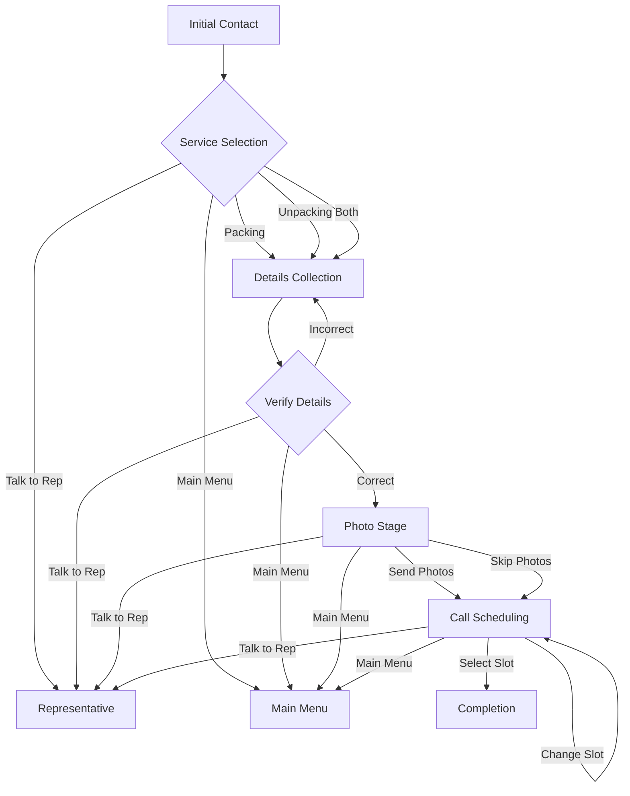
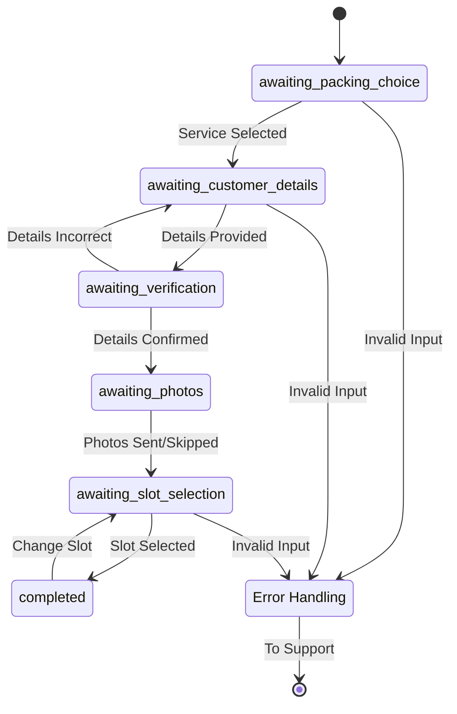

# Moving Service Flow

## Overview
The moving service provides a conversational interface for users to request moving services, including packing, unpacking, or both. The flow is designed to collect necessary information while providing a smooth user experience.

## Conversation Flow Diagram

## Service Options
1. **Packing Only (אריזת הבית)** 
   - Assistance with packing current home
   - Requires current address details
   
2. **Unpacking Only (סידור בבית החדש)**
   - Assistance with organizing new home
   - Requires new address details

3. **Full Service (ליווי מלא - אריזה וסידור)**
   - Complete moving assistance
   - Requires both current and new address details

## Detailed Flow

### 1. Initial Contact
- User sends any message
- System applies `bot_new_conversation` label
- Welcome message displays with header "מעבר דירה"
- Initial state: `awaiting_packing_choice`
- Options presented:
  * "אריזת הבית" (Packing)
  * "סידור בבית החדש" (Unpacking)
  * "ליווי מלא - אריזה וסידור" (Both)
  * Back to main menu
  * Talk to representative

### 2. Details Collection
Each service type requires specific information:

**Required for All Services:**
- Full name
- Email address
- Moving date (or estimated date)

**Address Requirements:**
- Packing Only: Current address (city, street, house number)
- Unpacking Only: New address (city, street, house number)
- Both Services: Both current and new addresses

### 3. Details Verification
- Header: "אימות פרטים ✅"
- System displays collected information
- User options:
  * "כן, הפרטים נכונים" (Confirm)
  * "לא, צריך לתקן" (Edit)
  * Back to main menu
  * Talk to representative

### 4. Photo/Video Collection
Header: "שליחת תמונות 📸"

**Photo Requirements:**
- Focus on open cabinets/closets
- Kitchen storage areas
- General home views

**Important Notes:**
- Photos are for quote purposes only
- Images are not stored permanently
- Users can either:
  * Send photos/videos
  * Skip this step ("מעדיפים לדלג")
  * Return to main menu
  * Request representative contact

### 5. Call Scheduling
Header: "תיאום שיחת טלפון 📞"

**Normal Flow:**
1. System explains need for brief coordination call
2. Displays dynamically generated time slots
3. User selects preferred time
4. Confirmation message shows selected slot
5. Option to change time: "שינוי מועד השיחה"

**Fallback Flow** (if slot generation fails):
- Header: "✅ הפניה התקבלה"
- Basic confirmation message
- Options to:
  * Return to main menu
  * Talk to representative

## Label Management

### Label Transitions
- Initial: `bot_new_conversation`
- Support Request:
  * Removes: `bot_new_conversation`
  * Applies: `waiting_for_support_urgent`
- Scheduled Call:
  * Removes: `bot_new_conversation`
  * Applies: `waiting_call_before_quote`

## Navigation & Error Handling

### Global Navigation
Available throughout the flow:
- Return to main menu
- Talk to representative option
- Back (context-aware)

### Error Handling
1. **Invalid Inputs:**
   - State-specific validation
   - Clear error messages
   - Maintains user progress

2. **Scheduling Issues:**
   - Graceful fallback to basic confirmation
   - Always provides way to contact support

3. **System Safeguards:**
   - State validation
   - Input type checking
   - Service type preservation

## State Machine

This documentation represents the complete flow of the moving service conversation, including all possible paths, error handling, and state transitions. The visual diagrams help illustrate the user journey and system behavior at each stage.