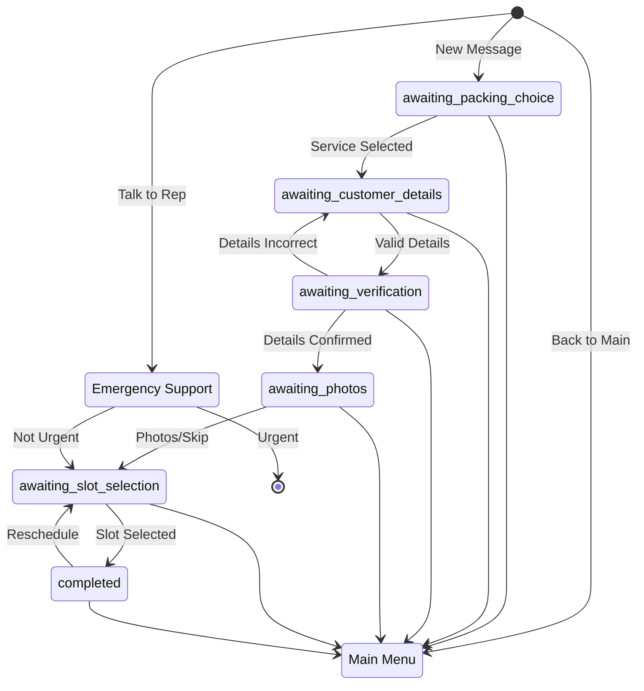

# Moving Service Flow

## Overview
The moving service provides a conversational interface for users to request moving services, including packing, unpacking, or both. The flow is designed to collect necessary information while providing a smooth user experience.

## State Flow

### 1. Initial Contact
- New message triggers the service
- System applies "new conversation bot" label
- System applies "moving" label when moving service is selected
- Welcome message displays with header "מעבר דירה"
- Initial state: `awaiting_packing_choice`
- Options presented:
  * "אריזת הבית" (Packing)
  * "סידור בבית החדש" (Unpacking)
  * "ליווי מלא - אריזה וסידור" (Both)
  * Back to main menu
  * Talk to representative

### 2. Details Collection
State: `awaiting_customer_details`

**Required for All Services:**
- Full name
- Email address
- Moving date (or estimated date)

**Address Requirements:**
- Packing Only: Current address (city, street, house number)
- Unpacking Only: New address (city, street, house number)
- Both Services: Both current and new addresses

**Validation:**
- Minimum 20 characters required
- If details are too short:
  * Error message displayed
  * Details collection form shown again

### 3. Details Verification
State: `awaiting_verification`

- System displays collected information
- User options:
  * "כן, הפרטים נכונים" (Proceed to photos)
  * "לא, צריך לתקן" (Return to details collection)
  * Back to main menu
  * Talk to representative

### 4. Photo Collection
State: `awaiting_photos`

**Options:**
- Send photos/videos
- Skip photos ("מעדיפים לדלג")
- Back to main menu
- Talk to representative

**Important Notes:**
- Photos are for quote purposes only
- Accepts both images and videos
- Photos are not stored permanently

### 5. Call Scheduling
State: `awaiting_slot_selection`

- System displays available time slots
- Options include:
  * Same day slots (12:00-14:00, 14:00-16:00, 16:00-18:00)
  * Next day slots (10:00-12:00, 12:00-14:00)
  * Back to main menu
  * Talk to representative

### 6. Slot Confirmation
State: `completed`
- Displays selected time slot
- Option to reschedule (returns to slot selection)
- Back to main menu
- Talk to representative

## Emergency Support Flow
Available at any point when "Talk to Representative" is selected:

1. Emergency question displayed: "האם הפנייה דחופה ודורשת שיחה מנציג כמה שיותר מהר?"
2. User options:
   - Yes: 
     * Remove "new conversation" label
     * Apply "waiting_urgent_support" label
     * Message: Support will contact shortly
   - No: 
     * Proceed to regular call scheduling flow

## Label Management

### Label Transitions
1. Initial Contact:
   - Apply "new conversation bot" label

2. Service Selection:
   - Apply "moving" label

3. Call Scheduled:
   - Remove "new conversation" label
   - Apply "waiting for call" label

4. Urgent Support:
   - Remove "new conversation" label
   - Apply "waiting_urgent_support" label

5. Main Menu Return:
   - Remove all service-specific labels
   - Keep only "new conversation bot" label

## Navigation
- "Return to main menu" option available throughout the flow
  * Returns to welcome message
  * Resets labels to only "new conversation bot"
  * Removes any other active labels

## State Machine

This documentation represents the complete flow of the moving service conversation, including all possible paths, error handling, and state transitions.