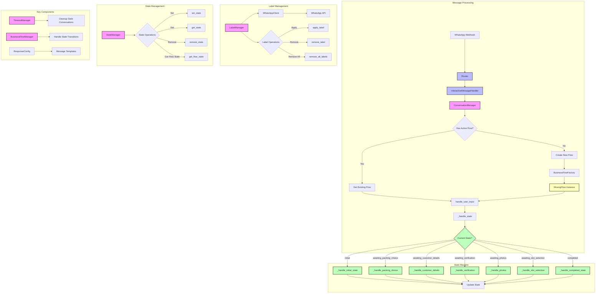

# Moving Service Technical Architecture

## Overview

The moving service implements a state machine pattern to handle user interactions through WhatsApp messages. The system processes both interactive button responses and text messages, managing conversation state, labels, and timeouts.

## System Components

## Key Components

### 1. Message Processing
- **Router**: Directs incoming webhook notifications to appropriate handlers
- **InteractiveMessageHandler**: Processes button clicks and text inputs
- **ConversationManager**: Coordinates all conversation-related operations

### 2. State Management
The `StateManager` class maintains conversation states:
- Maps user IDs to active business flows
- Provides atomic state operations:
  - `set_state`: Assign a flow to a user
  - `get_state`: Retrieve user's current flow
  - `remove_state`: End user's flow
  - `get_flow_state`: Get current state within flow

### 3. Label Management
The `LabelManager` handles WhatsApp conversation labels:
- Interfaces with WhatsApp API through WhatsAppClient
- Maintains user label history
- Key label operations:
  - `apply_label`: Add a label to conversation
  - `remove_label`: Remove specific label
  - `remove_all_labels`: Clear all labels

### 4. Moving Flow States
The `MovingFlow` class implements the state machine with these states:
1. `initial`: Welcome message and service selection
2. `awaiting_packing_choice`: Service type selection (packing/unpacking/both)
3. `awaiting_customer_details`: Collecting customer information
4. `awaiting_verification`: Verifying provided details
5. `awaiting_photos`: Optional photo submission
6. `awaiting_emergency_support`: Urgent support handling
7. `awaiting_slot_selection`: Call scheduling
8. `completed`: Final state

### 5. Label Transitions
- **New Conversation**: `new_conversation_bot` label applied
- **Moving Service**: `moving` label added when service selected
- **Call Scheduled**: `waiting_for_call` label replaces `new_conversation_bot`
- **Urgent Support**: `waiting_urgent_support` label replaces `new_conversation_bot`
- **Main Menu Return**: All labels removed except `new_conversation_bot`

### 6. Support System
Emergency support flow:
1. User requests support at any stage
2. System prompts for urgency confirmation
3. If urgent:
   - Remove `new_conversation_bot` label
   - Apply `waiting_urgent_support` label
4. If not urgent:
   - Continue to regular call scheduling

### 7. Additional Components
- **TimeoutManager**: Handles conversation expiration
- **BusinessFlowManager**: Manages state transitions
- **ResponseConfig**: Stores message templates
- **BusinessFlowFactory**: Creates appropriate flow instances

## Error Handling
- Input validation at each state
- Timeout management for stale conversations
- Graceful state transitions
- Support request handling at any state

## Configuration
Message templates and responses are externalized in configuration files:
- `moving.py`: Moving service specific responses
- `common.py`: Shared response templates