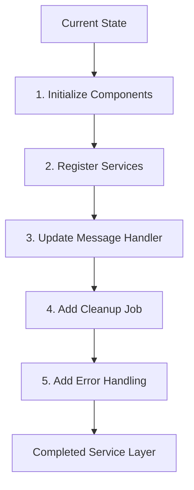

# Service Layer Completion Plan

## Overview

This document outlines the remaining steps to complete the service layer refinement from our improvement plan.

## Current Progress
- ✅ Implemented ConversationManager with timeout mechanism
- ✅ Implemented ServiceFactory with type registration
- ⬜ Integration with message handler
- ⬜ Cleanup job implementation
- ⬜ Error handling implementation



## Implementation Steps

### 1. Initialize Components

- Create Container class for dependency injection:
```python
from dependency_injector import containers, providers

class Container(containers.DeclarativeContainer):
    config = providers.Configuration()
    
    conversation_manager = providers.Singleton(
        ConversationManager,
        timeout_minutes=config.conversation.timeout_minutes
    )
    
    service_factory = providers.Singleton(
        ServiceFactory
    )
```

### 2. Register Services

- All services need to be registered with ServiceFactory during initialization:
```python
def register_services(factory: ServiceFactory):
    from src.services.organization_service import OrganizationService
    from src.services.design_service import DesignService
    from src.services.consultation_service import ConsultationService
    from src.services.moving_service import MovingService
    from src.services.other_service import OtherService

    factory.register(ServiceType.ORGANIZATION, OrganizationService)
    factory.register(ServiceType.DESIGN, DesignService)
    factory.register(ServiceType.CONSULTATION, ConsultationService)
    factory.register(ServiceType.MOVING, MovingService)
    factory.register(ServiceType.OTHER, OtherService)
```

### 3. Update Message Handler

Replace the global state with our new components:
```python
class MessageHandler:
    def __init__(self, conversation_manager: ConversationManager, service_factory: ServiceFactory):
        self.conversation_manager = conversation_manager
        self.service_factory = service_factory

    def handle_interactive_message(self, message: Dict[str, Any], base_payload: Dict[str, Any]) -> List[Dict[str, Any]]:
        button_reply = message.get('interactive', {}).get('button_reply', {})
        selected_option = button_reply.get('id', '')
        recipient = base_payload["to"]

        # Check existing conversation
        service = self.conversation_manager.get_conversation(recipient)
        if service:
            return service.handle_response(message)

        # Create new conversation if service selection
        if selected_option in RESPONSES['options']:
            try:
                service_type = ServiceType(selected_option)
                service = self.service_factory.create(service_type, recipient)
                self.conversation_manager.add_conversation(recipient, service)
                return service.handle_initial_message()
            except (ValueError, ConversationError) as e:
                logger.error(f"Failed to create service: {e}")
                return create_welcome_messages(recipient)

        return create_welcome_messages(recipient)
```

### 4. Add Cleanup Job

Implement background cleanup:
```python
from apscheduler.schedulers.background import BackgroundScheduler

def setup_cleanup_job(app: Flask, conversation_manager: ConversationManager) -> None:
    scheduler = BackgroundScheduler()
    scheduler.add_job(
        conversation_manager.cleanup_stale_conversations,
        'interval',
        minutes=5
    )
    scheduler.start()
```

### 5. Add Error Handling

Create custom exceptions:
```python
class WhatsAppBotError(Exception):
    """Base exception for WhatsApp bot errors"""
    pass

class ServiceCreationError(WhatsAppBotError):
    """Raised when service creation fails"""
    pass

class ConversationError(WhatsAppBotError):
    """Raised for conversation-related errors"""
    pass
```

## Next Steps

1. Switch to Code mode to implement these changes
2. Start with the Container class setup
3. Update the message handler to use dependency injection
4. Add the cleanup job
5. Implement error handling throughout the service layer

The changes will be implemented iteratively, with each component being tested as it's integrated.