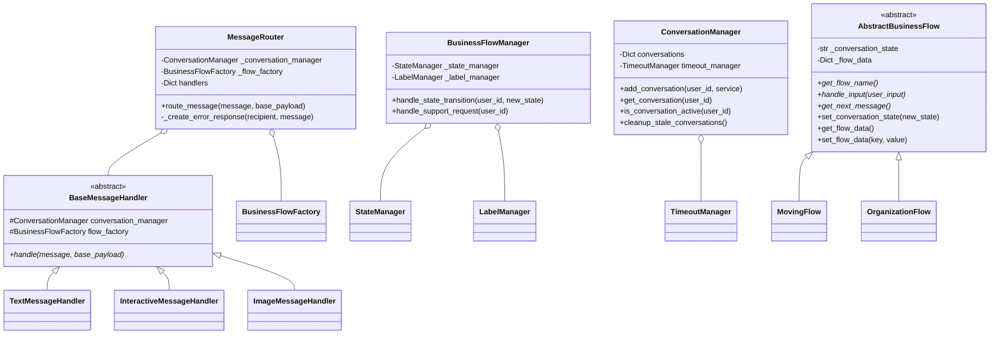

# WhatsApp Bot System Architecture

## System Overview Diagram

## Class Diagram

## Component Details

### 1. Message Processing Layer

#### Webhook Handler (app.py)
- Entry point for all incoming WhatsApp messages
- Validates webhook payloads
- Coordinates message processing and response sending
- Handles error conditions and status updates

#### Message Router
- Routes messages to appropriate handlers based on type
- Supports text, interactive, image, and video messages
- Maintains handler registry
- Provides error handling and fallback responses

### 2. Business Logic Layer

#### Business Flow Factory
- Creates appropriate business flow instances
- Manages flow creation and initialization
- Supports multiple flow types (Moving, Organization)

#### Business Flow Manager
- Coordinates business flows with state management
- Handles state transitions
- Manages WhatsApp labels
- Coordinates support requests

#### Abstract Business Flow
- Base template for all business flows
- Manages conversation state
- Handles flow-specific data storage
- Defines contract for flow implementation

### 3. State Management Layer

#### State Manager
- Tracks conversation states
- Manages state transitions
- Persists state information
- Provides state query capabilities

#### Label Manager
- Manages WhatsApp conversation labels
- Applies and removes labels based on state
- Supports multiple label types:
  - Flow-specific labels (moving, organization)
  - State-specific labels (new_conversation, urgent_support)
  - Process labels (waiting_call_before_quote)

#### Timeout Manager
- Monitors conversation timeouts
- Cleans up stale conversations
- Manages conversation lifecycle

### 4. Message Handlers

#### Base Message Handler
- Abstract base for all message handlers
- Provides common handler functionality
- Manages conversation context

#### Specialized Handlers
1. Text Message Handler
   - Processes text-based messages
   - Handles command interpretation
   - Manages text-based responses

2. Interactive Message Handler
   - Processes button and list responses
   - Manages menu interactions
   - Handles structured responses

3. Media Handlers
   - Image Handler: Processes image messages
   - Video Handler: Processes video messages
   - Validates media content
   - Manages media-specific responses

## State Management Details

### State Lifecycle
1. **Initial State**
   - New conversation started
   - Labels cleared
   - Bot_new_conversation label applied

2. **Flow States**
   - Flow-specific states (moving, organization)
   - State-specific labels applied
   - Flow data collected and stored

3. **Support States**
   - Emergency support handling
   - Urgent support labels applied
   - Support flow transition

4. **Completion State**
   - Flow completion
   - Final labels applied
   - Quote preparation state

### Error Handling

#### Graceful Degradation
- Handler-specific error catching
- Fallback responses
- State preservation
- User-friendly error messages

#### Recovery Mechanisms
- State restoration
- Label reconciliation
- Conversation cleanup
- Timeout management

## Extension Points

### Adding New Flows
1. Create new flow class extending AbstractBusinessFlow
2. Implement required methods:
   - get_flow_name()
   - handle_input()
   - get_next_message()
3. Register flow with BusinessFlowFactory
4. Add flow-specific state management
5. Configure flow-specific labels

### Adding Message Types
1. Create new handler class extending BaseMessageHandler
2. Implement handle() method
3. Register handler with MessageRouter
4. Add type-specific error handling
5. Update flow handling as needed

## Performance Considerations

### State Management
- In-memory state storage
- Timeout-based cleanup
- Efficient label management
- Optimized state transitions

### Message Processing
- Asynchronous message handling
- Efficient routing
- Optimized handler dispatch
- Quick response generation

### Resource Management
- Connection pooling
- Memory optimization
- Cleanup procedures
- Error recovery